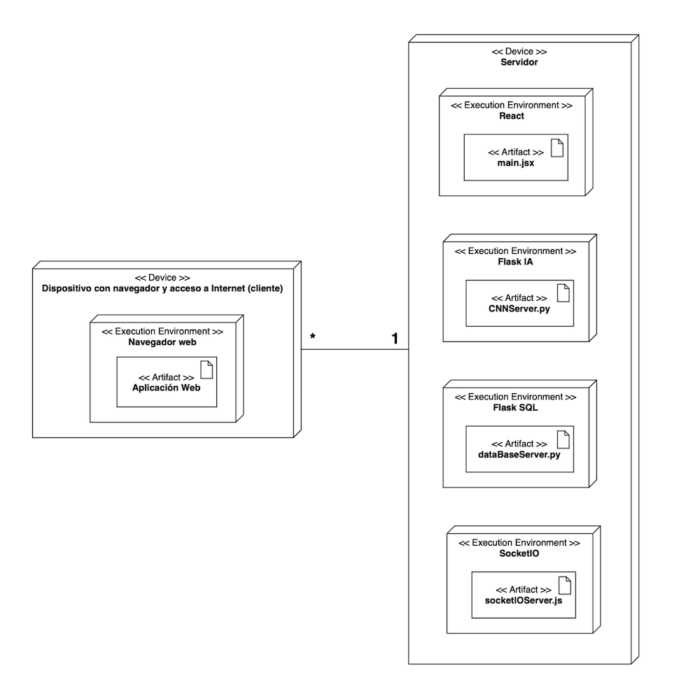

# DOODLE A DOODLE
El proyecto consiste en la implementación de una aplicación web multijugador que utiliza una red neuronal entrenada para reconocer los dibujos realizados por los jugadores. Además, los usuarios pueden crear o unirse a salas que hayan sido configuradas anteriormente por otros usuarios. 

La aplicación cuenta con varios modos de juego distintos para ofrecer la mayor variedad posible, pudiéndose cambiar ciertos parámetros de configuración de los mismos, como el número de
jugadores, rondas… Durante el desarrollo del juego, los usuarios deben dibujar el objeto que se les indica para qué posteriormente la inteligencia artificial valide el dibujo e indique el resultado con el porcentaje de
precisión de dicho objeto. 

También se ofrece la posibilidad de crear una cuenta en la aplicación para registrar los datos de las partidas que jueguen, a parte del resto de funcionalidades clásicas relacionadas con la gestión de una cuenta. (eliminar cuenta, modificar datos, validar cuenta…) 

<p align="center">
  
  
  
  
  
</p>

El sistema implementado está formado por una serie de servidores web, en el que cada uno tiene una responsabilidad diferente: Almacenamiento del modelo de Inteligencia Artificial entrenado y
validación de imágenes, base de datos con la información de los usuarios registrados, página web desplegada, funciones multijugador y gestión de salas de la aplicación.

<p align="center">
  
</p>


Para la tarea de visión artificial, se ha utilizado un modelo de clasificación de YOLOv8. YOLO es una familia de modelos de detección de objetos en tiempo real que se destacan por su velocidad y precisión. A diferencia de otros modelos que analizan la imagen en múltiples etapas, YOLO procesa toda la imagen de una vez, lo que le permite detectar objetos de manera más rápida y eficiente. 
Para el entrenamiento del modelo se han utilizado el data set de [Quick, Draw!](https://quickdraw.withgoogle.com/data) para obtener un total de 50000 imagenes repartidas en 50 clases.

Tras el entrenamiento, se ha geenrado la matriz de confusión para observar los resultados obtenidos:

<p align="center">
  
</p>


## INSTALACIÓN
-Se ha utilizado la versión 3.11.3 de Python.<br />
-En Linux se accede a la carpeta /bin para usar Python.<br />
-Es necesario instalar node y npm (versión igual o superior a 10.2.4).<br />
-Ejecutar el comando "npm i" para instalar los datos relacionados con Vite.<br />

Las librerías necesarias para la ejecución de los archivos de Python están desinstaladas para ahorrar espacio.

Instalar librerias de python:
```bash
cd doodleAdoodle
bin/python -m pip install -r requirements.txt 
```
Desinstalar librerias de python
```bash
cd doodleAdoodle
bin/python -m pip uninstall -r requirements.txt -y
```

## DESPLIEGUE
Servidor Flask con el modelo de la red neuronal convolucional:
```bash
cd doodleAdoodle
bin/python app/src/model/CNNServer.py
```

Servidor Flask con la base de datos de usuarios:
```bash
cd doodleAdoodle
bin/python app/src/model/dataBaseServer.py
```

Servidor de React de la aplicación web:
```bash
cd doodleAdoodle/app
npm run dev -- --host
```

Servidor multijugador de Socket.io:
```bash
cd doodleAdoodle
node app/src/model/socketIOServer.js
```


## NOTA
Para el correcto funcionamiento del envío de correos electrónicos es necesario crear una contraseña de aplciación y guardarla en la raiz del proyecto con el nombre ".password.txt".
